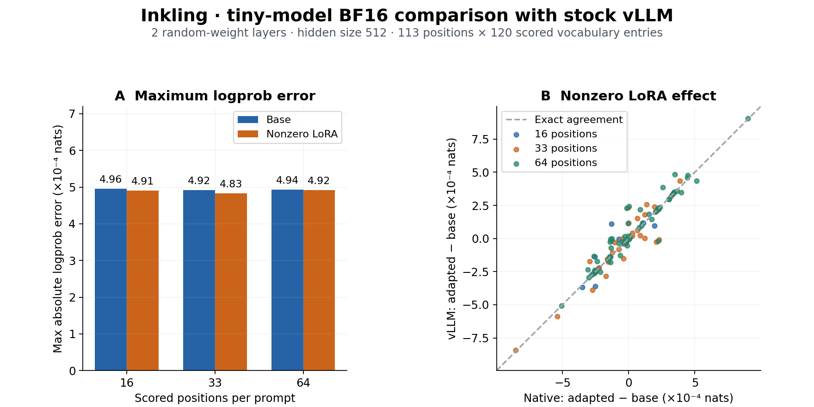
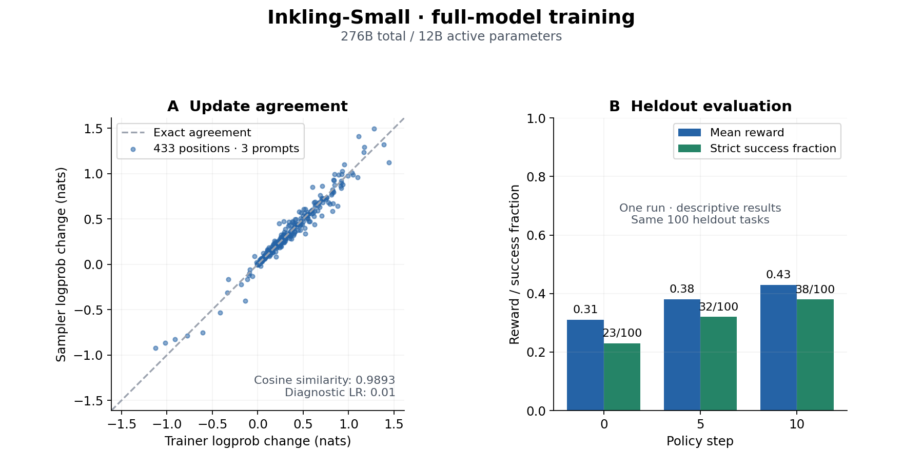

# Inkling test evidence for Megatron-Bridge #6170

These figures summarize recorded test artifacts. The evidence branch is separate
from the [implementation PR](https://github.com/NVIDIA-NeMo/Megatron-Bridge/pull/6170).

## Reproduce the figures

Download this directory, then run:

```sh
uv run --no-project --with matplotlib==3.10.8 --with numpy==1.26.4 python render.py
```

The renderer reads the two accompanying JSON files. Source artifact names and
SHA256 hashes identify the archived inputs; numeric arrays are included so the
figures can be regenerated without access to the experiment infrastructure.
Prompts, token IDs, task identifiers, credentials and internal infrastructure
addresses are omitted. The JSON files retain the scope and limitations of each
measurement.

## Tiny-model numerical diagnostics



The BF16 fixture has two random-weight text layers, hidden size 512, and a
120-token scored vocabulary. The three prompts contain 16, 33 and 64 scored
positions: 113 positions and 13,560 vocabulary comparisons per variant.
Base and nonzero attention-LoRA results are compared with stock vLLM. The
adapter stimulus is deterministic; this diagnostic does not train the adapter.
The panels show maximum errors across the 120 scored vocabulary entries and
target-token adapter-effect agreement. Absolute differences are diagnostic, not
an invented acceptance threshold. This fixture does not establish parity of
the published 276B checkpoint.

Exact source attribution and measured values are in [bridge-data.json](bridge-data.json).
The base receipt hashes a model source matching `0d4457af`, with dense-only
activation fusion selected by the harness. That behavior became `7cd9a887`;
these are candidate measurements, not an exact-commit GPU rerun. The LoRA
receipt records fixture and script hashes but no independent model-source hash.

## Native full-model integration



Inkling-Small has 276B total / 12B active parameters. These runs used 16 H200s
(eight learner, eight sampler), Bridge `7cd9a887`, SkyRL `99bf425d` and the
frozen runtime identified by full digests in [e2e-data.json](e2e-data.json).
They were not rerun on cleanup head `f2e39f10`. The figure shows update agreement
and Tau10 heldout evaluation; the JSON also retains the capacity and two-update
results below.

- **Update and restore agreement, XID 1057142:** 433 matched response positions
  across three prompts. The plotted change uses a diagnostic learning rate of 0.01. Restore was
  checked against frozen tolerances, not bit-exact trainer scores.
- **Long-context capacity, XID 1057146:** one sequence with 32,768 supervised
  positions and two retained backwards. Recorded learner allocator peaks cover
  the profiled operation window; they are neither sampler memory nor physical
  device high-water marks. Capacity minus reservation is not measured free
  memory. This check does not establish packed-batch capacity.
- **Tau2, XID 1057417:** two completed updates, 1,024 clean trained trajectories,
  and the same 100 heldout tasks at policies 0 and 2. Mean reward 0.305 to 0.335
  and strict successes 22 to 25 are descriptive single-run results. There were
  13 improved, 78 unchanged and nine worsened task rewards.
- **Tau10, XID 1057648:** ten of ten updates completed, with 5,120 trained
  trajectories and zero terminal errors. The same 100 heldout tasks at policies
  0, 5 and 10 had mean rewards **0.31 / 0.38 / 0.43** and strict successes
  **23 / 32 / 38 out of 100**. From policy 0 to 10, task rewards improved on 23,
  were unchanged on 68 and worsened on nine. These are descriptive single-run
  results. Checkpoints 0, 5 and 10 committed; the runner exited successfully.
  This fresh run used the same GPU runtime, plus the merged CPU checkpoint
  completion check in Trajectory PR #6490 (source `43329a6a`). Maintainer GPU CI
  on the current implementation head remains pending.
- **Prior Tau10 attempt, XID 1057459:** stopped after five of ten updates when
  checkpoint 5 failed with ENOSPC. Its recorded data remain in
  `tau10_failed_attempt` in the JSON; its updates are not combined with the
  completed fresh run.

Pass/fail checks, skipped CUDA tests and unverified capabilities are listed
separately in the PR rather than converted into a combined pass rate.
